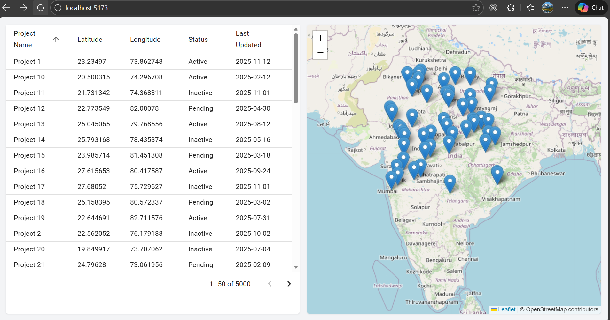
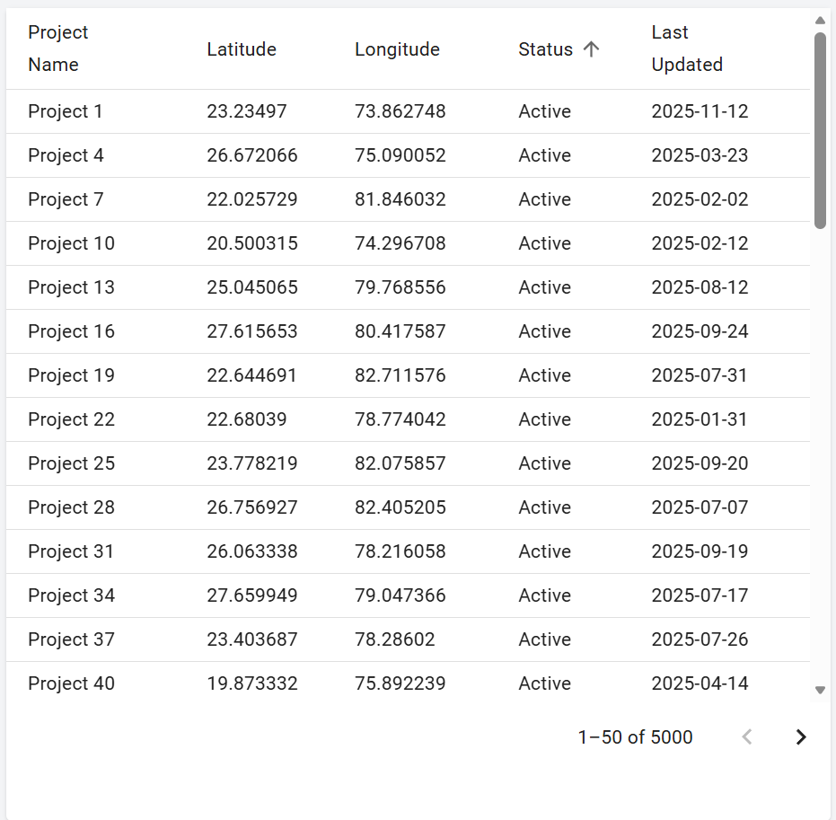
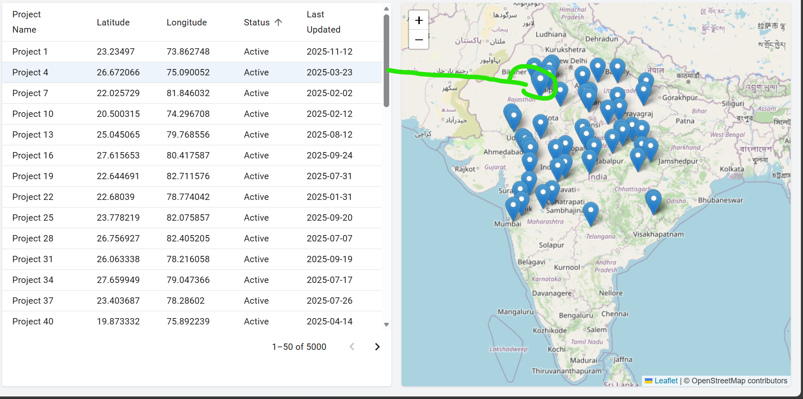
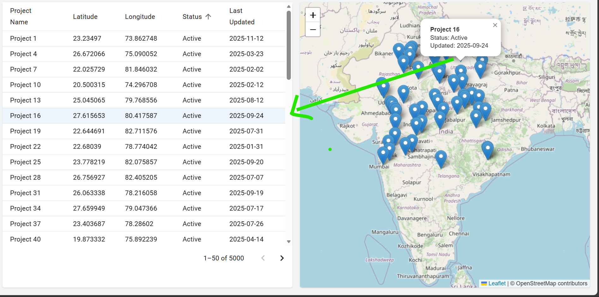

# Geo Data Dashboard

A React-based Geo Data Dashboard built as part of a technical assignment.  
The application visualizes **tabular and spatial data together**, focusing on clean architecture, performance, and synchronized UI behavior.

---

## Objective

To build a dashboard that:
- Displays geospatial data in a table and on a map
- Handles large datasets efficiently (5,000+ records)
- Keeps map and table interactions in sync
- Uses only local React state (no Redux)

---

## Features

### Data Table
- Paginated data loading (server-style mock API)
- Columns:
  - Project Name
  - Latitude
  - Longitude
  - Status
  - Last Updated
- Client-side sorting
- Row selection highlighting

### Map Integration
- Interactive map using Leaflet
- Markers plotted using latitude & longitude
- Clicking a table row highlights the corresponding marker
- Clicking a marker highlights the corresponding table row

### State Management
- Local state using React hooks only
- Single source of truth maintained in the dashboard page
- Clean separation between UI and data logic

---

## Tech Stack

- **React (Vite)**
- **Material UI (MUI)** – Table, pagination, sorting
- **Tailwind CSS** – Layout and styling
- **React-Leaflet + Leaflet** – Map visualization
- **JavaScript (ES6+)**

---

## Project Structure

```txt
src/
├── api/
│   └── geoApi.js            # Mock API with pagination
├── components/
│   ├── DataTable/
│   │   ├── DataTable.jsx
│   │   └── columns.js
│   ├── MapView/
│   │   └── MapView.jsx
├── hooks/
│   └── useGeoData.js        # Data fetching hook
├── utils/
│   └── filterSort.js        # Sorting & filtering logic
├── pages/
│   └── Dashboard.jsx        # Central state & orchestration
├── data/
│   └── geoData.json         # Mock dataset (5000+ rows)
├── App.jsx
└── main.jsx
```
## Data Format

Each record in the dataset follows this structure:

```json
{
  "id": 1,
  "projectName": "Project 1",
  "latitude": 28.6139,
  "longitude": 77.2090,
  "status": "Active",
  "lastUpdated": "2024-01-10"
}
```

## Architecture Decisions

- A single source of truth is maintained in `Dashboard.jsx` to synchronize table and map interactions.
- Local React state (`useState`, `useCallback`, `useMemo`) is used instead of Redux to keep the solution simple.
- Data fetching is separated into a custom hook (`useGeoData`) for better maintainability.
- Sorting and filtering logic is abstracted into utility functions to keep UI components clean.

---

## Performance Considerations

- Server-style pagination limits the number of rows rendered at a time.
- Sorting and derived data are memoized to avoid unnecessary re-computation.
- Map markers are rendered only for the currently visible dataset.
- Tested with **5,000+ records** without noticeable UI lag.
---
## Time Spent

Approximately **6–8 hours**, including:
- Architecture planning
- Project setup
- Mock data and API creation
- Table and map integration
- Performance optimization
- Documentation

## How to Run Locally

```bash
npm install
npm run dev

````

## Screenshots

### Dashboard Overview


### Table Sorting


### Table to Map Synchronization


### Map to Table Synchronization



